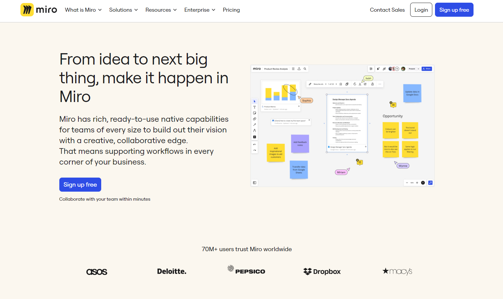

# Portfólio

Este projeto tem como objetivo demonstrar a minha capacidades em elabor planos de teste e análise de requisitos.

Neste repositório, você ira encontrar análise de dois (2) projetos, sendo eles:

-Análise de requisitos de um protótipo no Miro 
 
-Plano de Teste de um site

## Portfólio Analise de requisitos

Protótipo do Miro [ProjetoTODO-MVC](https://miro.com/app/board/uXjVNxAQG98=/)

## Portfólio Plano de Teste

Site utilizado para desenvolvimento do Plano [TODO-MVC](https://todomvc.com/examples/react/dist/ )

