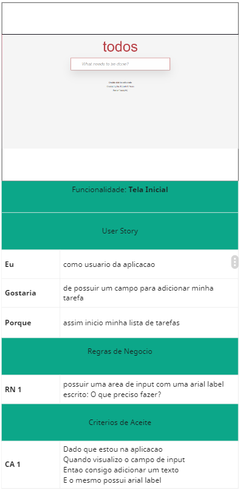

# Projeto Storytelling TODO-MVC

Este projeto foi criado com o propósito de exercitar a análise técnica de um projeto real de **Storytelling** de um site. Feito um projeto de templates no **Miro**. Através deste protótipo, irei analisar os requisitos e colocá-lo em execução em um plano de teste.

## Protótipo
- Protótipo do Miro [ProjetoTODO-MVC](https://miro.com/app/board/uXjVNxAQG98=/)

## Analise do projeto

A imagem abaixo indica como a análise do projeto foi realizada, utilizando o **MIRO** para fazer a análise de forma visual.

- Anexo da imagem a ser analisada.
- Funcionalidade 'Tela Inicial' que iremos testar.
- User Story com descrição em alto nível indicando o que o  usuário deseja usar, a funcionalidade desejada e o motivo da existência desta funcionalidade.
- Listagem das regras de negócio a serem implementadas.

### Referência da analise

- Func - 1 Tela Inicial

- Func - 2 Adicionar itens

- Func - 3 Validar Filtros - Todos

- Func - 4 Validar Filtros - Ativos

- Func - 5 Validar Filtros - Concluído

- Func - 6 Conclusão de itens - Unitária

- Func - 7 Conclusão de itens - Em lotes

- Func - 8 Limpar itens finalizados