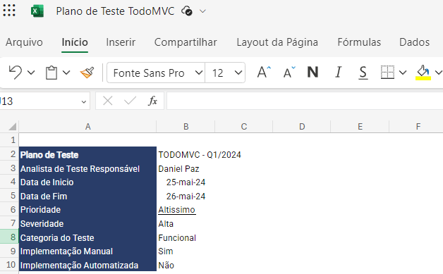
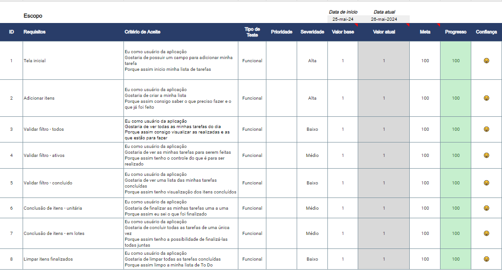
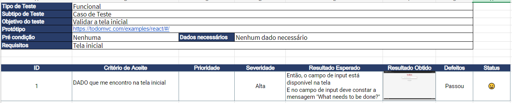
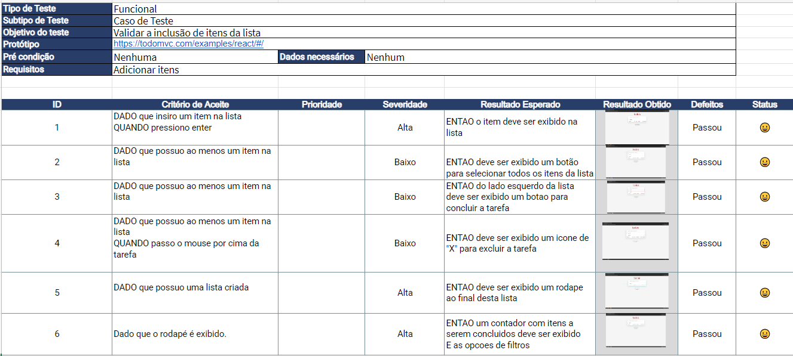
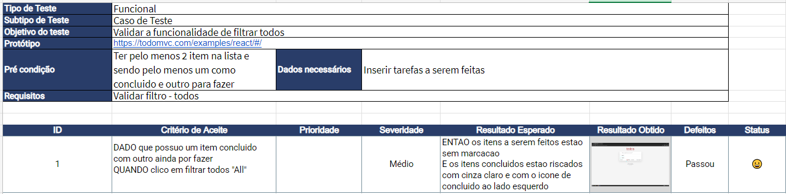
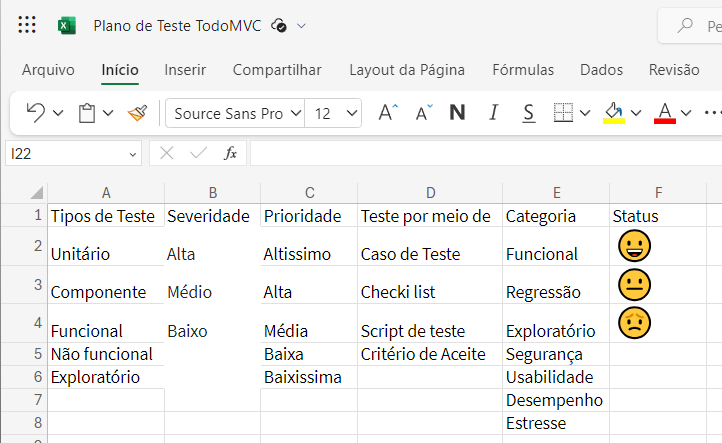

# Projeto TODO-MVC
Este projeto foi criado com o propósito de praticar a criacao e execucao do **Plano de Teste** de um projeto. Levando em consideração um site já existente, irei realizar o levantamento dos seus requisitos, criando suites e casos de teste para execução.

## Ferramentas

-Site utilizado para desenvolvimento do Plano [TODO-MVC](https://todomvc.com/examples/react/dist/ )

- Excell para a criação do Plano de teste

## Plano de Teste

### Apresentação do Plano

Na aba Introdução da planilha irá conter todas as informações básicas do projeto.

## Apresentação do Escopo

Na aba Escopo da planilha irá conter todos os levantamentos de requisitos, critério de aceite, os tipos de testes que serão realizados, assim como a severidade deles. Além da meta e progresso de cada um.

   

## Apresentação da Suite - Tela Inicial

Antes de tudo, em todas as Suites têm as mesmas funcionalidades, então para não ficar redundante e repetitivo, vou listar as funções delas abaixo e detalhar em cada uma o propósito da mesma.

- Critérios de Aceite: São as condições que o teste deve cumprir para passar,

- Resultado Esperado: É o que deveria acontecer quando o teste é executado corretamente.

- Resultado Obtido: É o que realmente aconteceu durante a execução do teste, independete se passou ou não.

- Registro de Defeito: É uma forma de documentar defeitos e bugs com evidências.

- Indicador de Status: É uma representação visual do resultado do teste.

Na aba Suite - Tela Inicial tem como objetivo validar se a tela inicial se comporta como o critério de aceite, contém o caso de teste funcional que valida a função anterior.

## Apresentação da Suite - Adicionar Itens

Na aba Suite - Adicionar Itens se comporta como o critério de aceite, contém o caso de teste funcional que valida a função anterior.

## Apresentação da Suite - Filtrar Itens Todos

Na aba Suite - Filtrar Itens Todos se comporta como o critério de aceite, contém o caso de teste funcional que valida a função anterior.

## Apresentação dos Macros

Na aba Macros esta todas as regras e configuracoes da planilha ex:

- Tipos de teste
- Severidade
- Prioridade
- Meios de teste
- Status com emojis

Esta planilha foi disponiblizado pela Priscila de Araujo Caimim, professora da plataforma Qualiters Club. Plataforma de onde estudo.