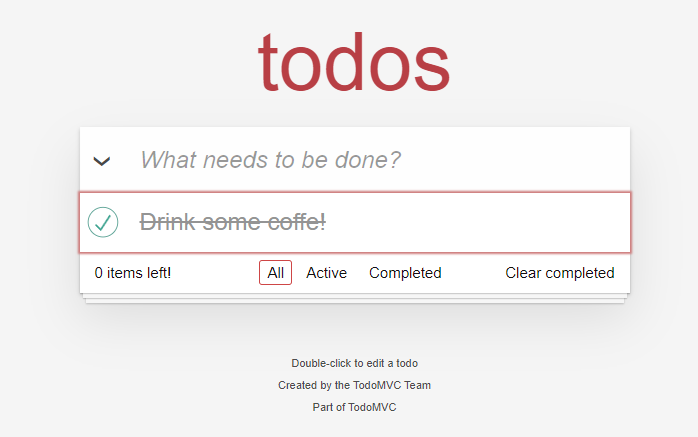

# Projeto TODO-MVC
Este projeto foi criado com o propósito de praticar a criacao e execucao do **Plano de Teste** de um projeto. Levando em consideração um site já existente, irei realizar o levantamento dos seus requisitos, criando suites e casos de teste para execução.

## Ferramentas

-Site utilizado para desenvolvimento do Plano [TODO-MVC](https://todomvc.com/examples/react/dist/ )

- Excell para a criação do Plano de teste

## Plano de Teste

### Apresentação do Plano

Na aba Introdução da planilha irá conter todas as informações básicas do projeto.

## Apresentação do Escopo

Na aba Escopo da planilha irá conter todos os levantamentos de requisitos, critério de aceite, os tipos de testes que serão realizados, assim como a severidade deles. Além da meta e progresso de cada um.

   

## Apresentação da Suite - Tela Inicial

Na aba Suite - Tela Inicial contém o caso de teste funcional que valida a tela inicial. Com o critério de aceite, severidade, resultado esperado, resultado obtido, se houve defeito e com status de Emojis que vão de carinha triste a feliz dependendo do resultado esperado.

## Apresentação da Suite - Adicionar Itens

Na aba Suite - Adicionar Itens contém o caso de teste funcional que valida a inclusão de itens na lista. Com o critério de aceite, severidade, resultado esperado, resultado obtido, se houve defeito e com status de Emojis que vão de carinha triste a feliz dependendo do resultado esperado.

## Apresentação da Suite - Filtrar Itens Todos

Na aba Suite - Filtrar Itens Todos contém o caso de teste funcional que valida a a funcionalidade de filtrar todos. Com o critério de aceite, severidade, resultado esperado, resultado obtido, se houve defeito e com status de Emojis que vão de carinha triste a feliz dependendo do resultado esperado.